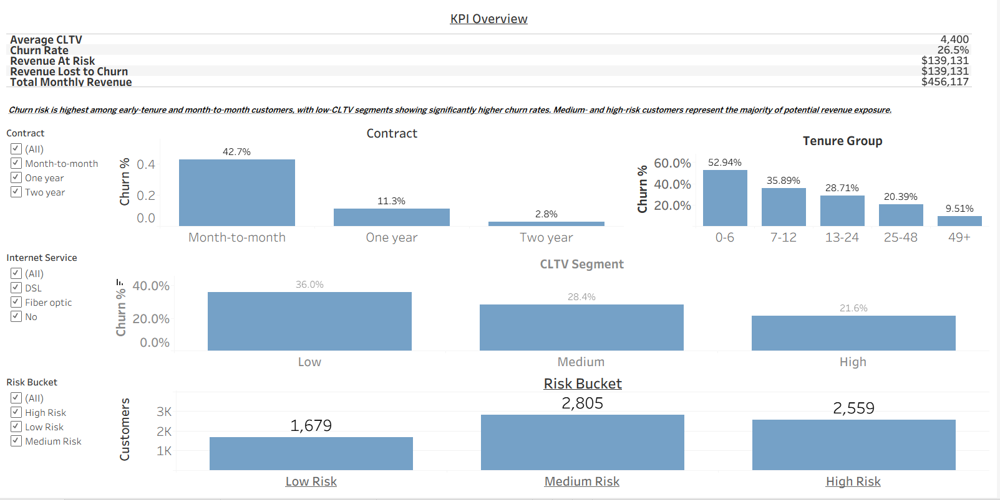
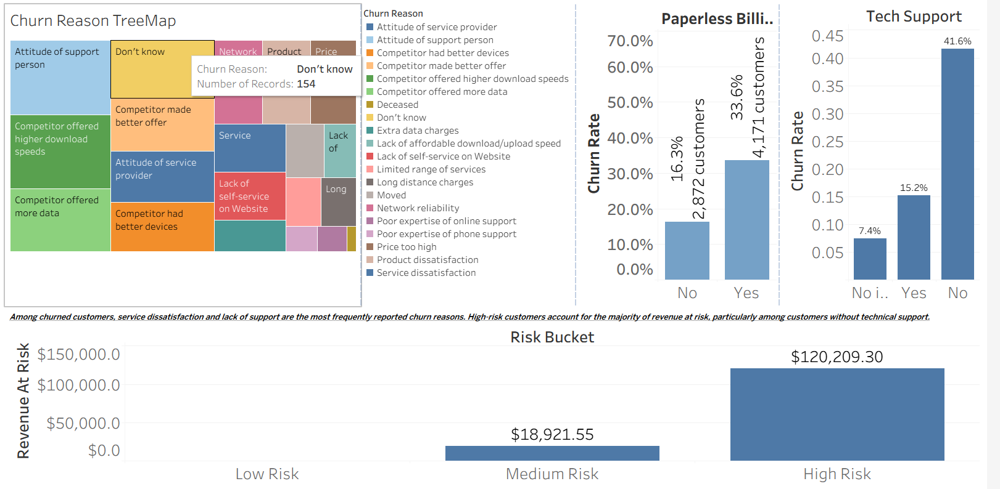
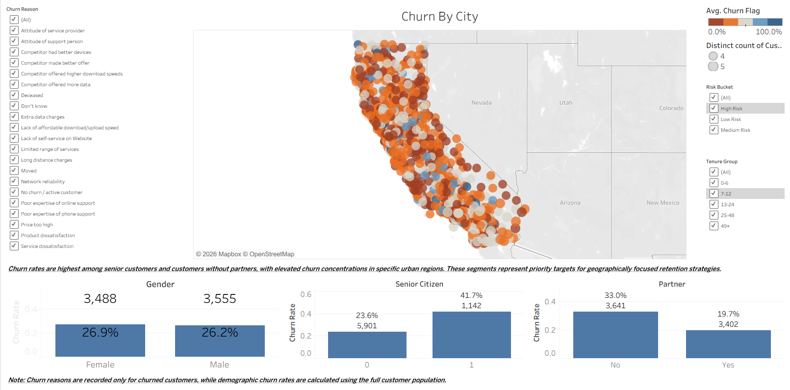
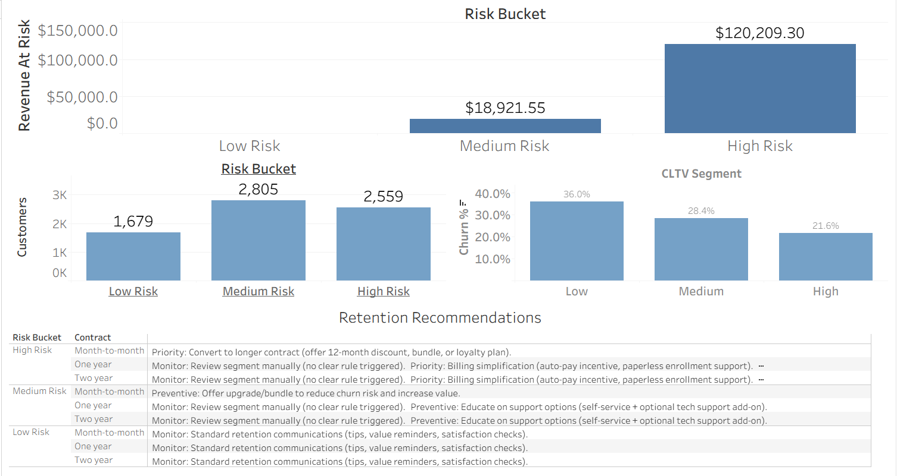

📘 README.md

Telecom Churn Business Intelligence & Retention Dashboard

📌 Project Overview

Customer churn is a critical challenge in the telecommunications industry, directly impacting recurring revenue and customer lifetime value.

This project delivers an end-to-end Business Intelligence solution that:

identifies who is churning and why,

quantifies revenue at risk,

segments customers by churn risk, and

translates analytics into clear retention recommendations.

The workflow mirrors a real-world analytics pipeline used in enterprise BI teams:

Raw Data → Python Analytics → Tableau Dashboards → Business Decisions

🎯 Business Objectives

Understand churn patterns across customer segments

Identify key drivers of churn

Quantify financial exposure from churn

Highlight high-priority retention targets

📊 Dashboards Included
1️⃣ Executive Overview

High-level KPIs and churn segmentation designed for leadership and decision-makers.

Key questions answered:

What is the overall churn rate?

How much revenue is currently at risk?

Which customer segments are most vulnerable?

Key components:

Overall churn rate

Revenue at risk

Churn by contract type

Churn by tenure group

Churn by CLTV segment

Risk bucket distribution

Purpose:
Provide a fast, executive-level snapshot of churn exposure and financial impact.

2️⃣ Churn Drivers & Segmentation

Explains why customers churn by focusing on behavioral and service-related drivers.

Key questions answered:

What reasons do churned customers report?

Which service features are associated with higher churn?

Where is revenue exposure concentrated?

Key components:

Churn reason treemap (churned customers only)

Impact of billing method (paperless vs non-paperless)

Impact of technical support

Revenue exposure by risk bucket

Purpose:
Translate churn outcomes into actionable service and product insights.

3️⃣ Geography & Demographics

Explores where churn is concentrated across geographic and demographic dimensions.

Key questions answered:

In which cities and regions is churn highest?

Which demographic groups are more likely to churn?

How does household composition influence churn?

Key components:

Churn by city (map view)

Churn by gender

Churn by senior citizen status

Churn by partner / household composition

Purpose:
Identify targetable populations and regions for focused retention efforts.

4️⃣ Risk & Retention Strategy

Converts churn analytics into concrete retention actions and prioritization logic.

Key questions answered:

Which risk segments drive the most revenue exposure?

How are customers distributed across risk buckets?

Which customer segments should receive immediate retention attention?

What actions should be taken for each risk-contract combination?

Key components:

Risk bucket distribution (customer volume)

Revenue at risk by risk bucket

Churn rate by CLTV segment

Retention recommendations by:

Risk bucket

Contract type

Purpose:
Bridge analytics and business execution by providing decision-ready retention guidance instead of raw metrics.

📸 Dashboard screenshots are available in /images.

## Dashboards

### 1) Executive Overview

### 2) Churn Drivers & Segmentation

### 3) Geo & Demographics

### 4) Risk & Retention Strategy

🛠 Tools & Technologies

Python (pandas, Jupyter) — data profiling & feature engineering

Tableau — interactive dashboards & storytelling

Git / GitHub — version-controlled analytics workflow

📂 Repository Structure
telecom-churn-bi-dashboard/
│
├─ data/
│   ├─ raw/                # Original dataset (unchanged)
│   └─ processed/          # Clean analytic dataset for Tableau
│
├─ notebooks/
│   ├─ 01_data_overview.ipynb
│   └─ 02_feature_engineering.ipynb
│
├─ tableau/
│   └─ Telco_Churn_Story.twb
│
├─ docs/
│   ├─ technical_documentation.md
│   └─ data_dictionary.md
│   └─ executive_summary.md
│
├─ images/
│   └─ dashboard screenshots
│
└─ README.md

▶️ How to Run

Run notebooks in /notebooks to generate the analytic dataset

Open the Tableau workbook in /tableau

Explore dashboards and story views

🚀 Future Extensions

Predictive churn modeling

Retention uplift analysis

Campaign effectiveness tracking

Automated scoring pipelines